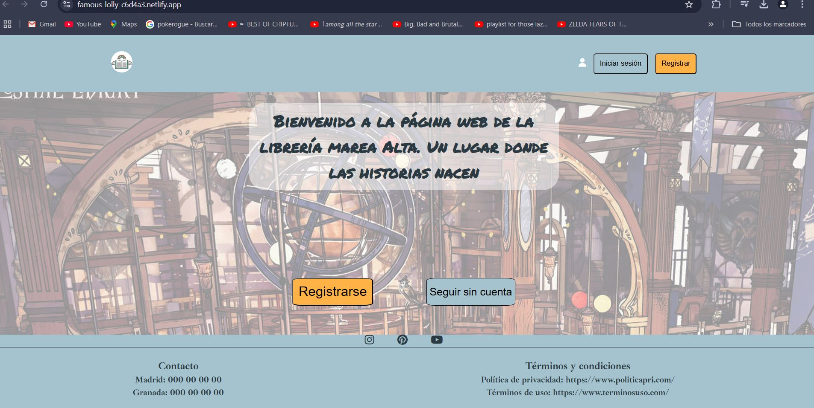
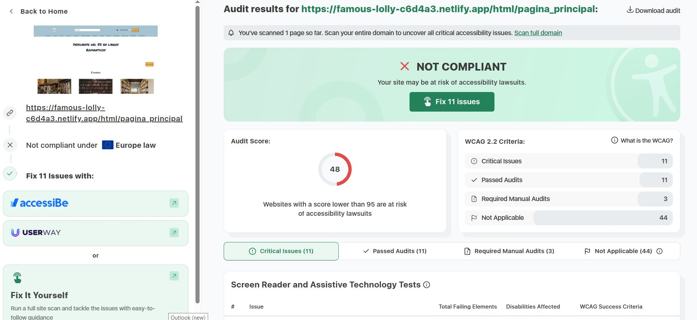
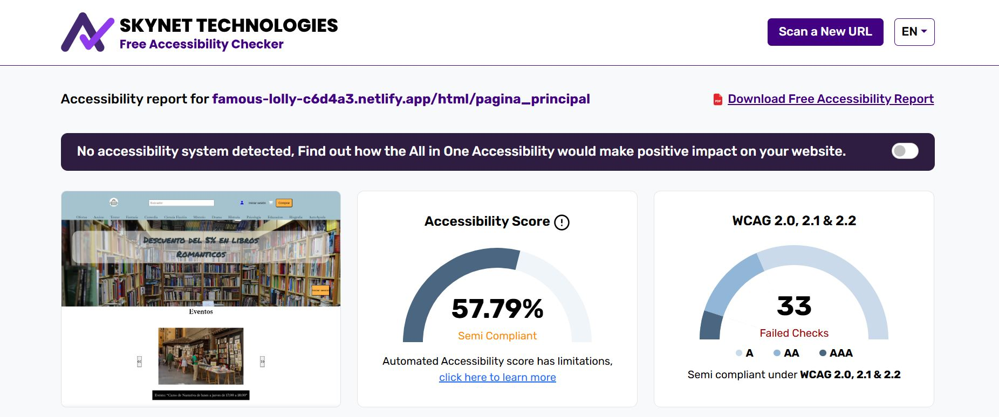
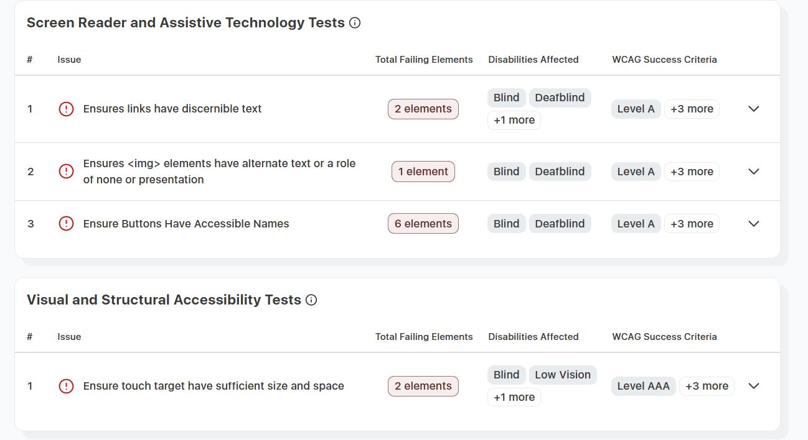
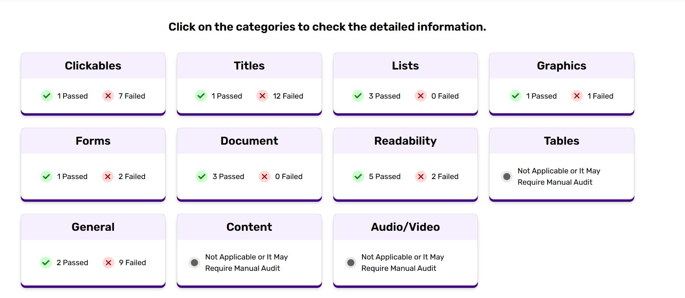

## Pruebas de Accesibilidad
En este apartado, el objetivo es garantizar que la página web cumpla con los criterios de accesibilidad del nivel AA de las *Pautas de Accesibilidad para el Contenido Web* (**WCAG**). Para ello, vamos a utilizar distintas herramientas de validación, tanto en línea como locales, para identificar los problemas y solucionarlos.

### 1. Netlify

Para usar estas herramientas es necesario subir el proyecto web a un dominio, para ello he usado Netlify. Los pasos que he seguido son los siguientes:

- Iniciar sesión con mi cuenta de GitHub.
- Asociar este repositorio como nuevo sitio.
- Indicar que al iniciar el lanzamiento del repositorio, ejecute el comando:

```bash
npm run build
```

 - La configuración que he puesto en netlify para que todo funcione correctamente es la siguiente: 

<br>


- Por último, tendremos que esperar a que se inicie el despliegue:

<br> 

### 2. Herramientas

 - Accesibility Checker:
    - Herramienta en línea que otorga una puntuación de accesibilidad y muestra los problemas de la web.

 - Skynet Technologies:
    - Herramienta en línea que analiza la web, proporciona un porcentaje de accesibilidad y una lista de errores.


### 3. Resultados Iniciales
Para comprobar la accesibilidad de mi web, deberemos seguir el proceso comentado anteriormente para que las 2 herramientas analicen la web y muestren los resultados.

#### 3.1. Resultados

- Resultados Accesibility Checker:
 <br><br>

- Resultados Skynet Technologies: 
 <br><br>

#### 3.2. Errores Encontrados

- Errores Accesibility Checker:
 <br><br>

- Errores Skynet Technologies: 
 <br><br>

 Cada web muestra fallos o errores en función del criterio o reglas que usen para analizar la web. Pero sí que muestran una serie de errores en común que voy a solucionar de la forma que me indican.

- Errores comunes:
    - Links

    - Nombres accesibles


### 4. Análisis de Fallos y Solución
Ahora mostrare los fallos que me han idicado las páginas y mostraré una foto con el resultado de arreglar esos fallos. 

- Los botones deben estar etiquetados correctamente: Los botones deben incluir texto que explique su funcionalidad y, si se utilizan íconos como botones, se debe utilizar solo un texto para lector de pantalla o un atributo "aria-label" para esa descripción.

- La etiqueta de encabezado no debe estar vacía.

- Los títulos deben tener una jerarquía consistente

- Se debe proporcionar un título para el documento, utilizando un elemento de título que no esté vacío en la sección del encabezado.

- Todas las etiquetas img deben tener atributos alt.

- Todos los campos del formulario deben estar etiquetados correctamente.

- Se debe proporcionar una relación de contraste de al menos 3:1.

- Los atributos ARIA deben ser válidos.

- Asegúrese de que el objetivo táctil tenga el tamaño y el espacio suficientes

### 5. Comprobación de las Soluciones


#### 5.1. Resultados + Soluciones Errores
