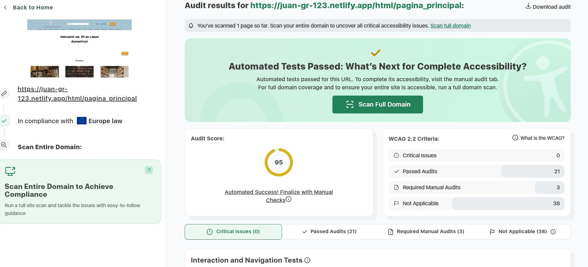
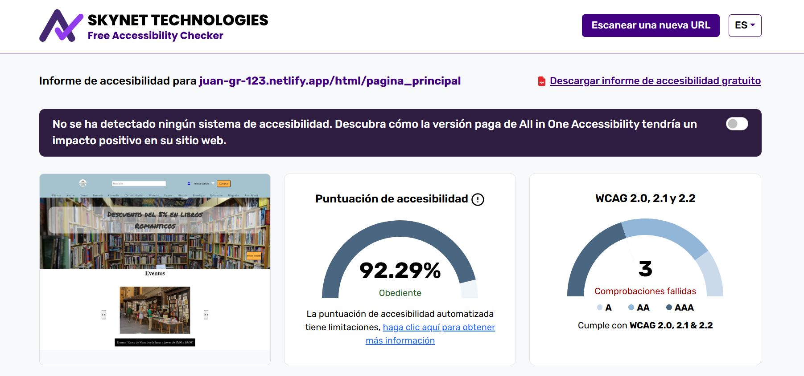

# DIW_Proyecto_Libreria_marea_Alta
Este repositorio contiene el proyecto **Libreria_marea_Alta**, desarrollado para la asignatura **Diseño de Interfaces Web** como parte del curso de **2º DAW**.

- El objetivo del proyecto es diseñar y estructurar una página web completa para una librería ficticia llamada **Libreria Marea Alta**.

-  Creado por: **Juan García Rosales**  

## Índice
## Índice
- [Pruebas de Accesibilidad](#pruebas-de-accesibilidad)
   - [1. Netlify](#1-netlify)  
   - [2. Herramientas](#2-herramientas)  
   - [3. Resultados Iniciales](#3-resultados-iniciales)
      - [3.1. Resultados](#31-resultados)  
      - [3.2. Errores Encontrados](#32-errores-encontrados)  
   - [4. Análisis u listado de Fallos](#4-análisis-y-listado-de-fallos)  
   - [5. Comprobación de las Soluciones](#5-comprobación-de-las-soluciones)
- [Pruebas de Usabilidad](#pruebas-de-usabilidad)
   - [1. Usuarios seleccionados ](#1-usuarios-seleccionados)
   - [2. Tareas asignadas](#2-tareas-asignadas)
   - [3. Resultados de las pruebas](#3-resultados-de-las-pruebas)
   - [4. Propuestas de mejora](#4-propuestas-de-mejora)
   - [5. Conclusión](#5-conclusión)

## Pruebas de Accesibilidad
En este apartado, el objetivo es garantizar que la página web cumpla con los criterios de accesibilidad del nivel AA de las *Pautas de Accesibilidad para el Contenido Web* (**WCAG**). Para ello, vamos a utilizar distintas herramientas de validación, tanto en línea como locales, para identificar los problemas y solucionarlos.

### 1. Netlify

Para usar estas herramientas es necesario subir el proyecto web a un dominio, para ello he usado Netlify. Los pasos que he seguido son los siguientes:

- Iniciar sesión con mi cuenta de GitHub.
- Asociar este repositorio como nuevo sitio.
- Indicar que al iniciar el lanzamiento del repositorio, ejecute el comando:

```bash
npm run build
```

 - La configuración que he puesto en netlify para que todo funcione correctamente es la siguiente: 

<br>


- Por último, tendremos que esperar a que se inicie el despliegue:

<br> 

### 2. Herramientas

 - Accesibility Checker:
    - Herramienta en línea que otorga una puntuación de accesibilidad y muestra los problemas de la web.

 - Skynet Technologies:
    - Herramienta en línea que analiza la web, proporciona un porcentaje de accesibilidad y una lista de errores.


### 3. Resultados Iniciales
Para comprobar la accesibilidad de mi web, deberemos seguir el proceso comentado anteriormente para que las 2 herramientas analicen la web y muestren los resultados.

#### 3.1. Resultados

- Resultados Accesibility Checker:
 <br><br>

- Resultados Skynet Technologies: 
 <br><br>

#### 3.2. Errores Encontrados

- Errores Accesibility Checker:
 <br><br>

- Errores Skynet Technologies: 
 <br><br>

 Cada web muestra fallos o errores en función del criterio o reglas que usen para analizar la web. Pero sí que muestran una serie de errores en común que voy a solucionar de la forma que me indican.

- Errores comunes:
    - Links

    - Nombres accesibles


### 4. Análisis y listado de Fallos
Ahora ire indicando los fallos que me han ido mostrando las páginas y mostraré una foto con el resultado de arreglar esos fallos. 

- Los botones deben estar etiquetados correctamente: Los botones deben incluir texto que explique su funcionalidad y, si se utilizan íconos como botones, se debe utilizar solo un texto para lector de pantalla o un atributo "aria-label" para esa descripción.

- La etiqueta de encabezado no debe estar vacía.

- Los títulos deben tener una jerarquía consistente

- Se debe proporcionar un título para el documento, utilizando un elemento de título que no esté vacío en la sección del encabezado.

- Todas las etiquetas img deben tener atributos alt.

- Todos los campos del formulario deben estar etiquetados correctamente.

- Se debe proporcionar una relación de contraste de al menos 3:1.

- Los atributos ARIA deben ser válidos.

- Asegúrese de que el objetivo táctil tenga el tamaño y el espacio suficientes

### 5. Comprobación de las Soluciones

Una vez arreglados todos los fallos que me han ido diciendo el resultado que deberán darnos las pruebas de accesibilidad tendrá que ser parecido a los siguientes resultados:

- Accesibility Checker:
<br><br>


- Skynet Technologies
 <br><br>


Como podemos ver a continuación la puntuación de la accesibilidad de mi página a aumentado bastante:

- En Accesibility Checker, la puntuación era 48. Ahora, con todos los cambios, la puntuación ha pasado a ser 95.
- En Skynet Technologies, la puntuación era de 57.79%. Ahora, con todos los cambios, la puntuación a pasado ha ser de 92.29%.

## Pruebas de Usabilidad

En este apartado se describe el proceso de pruebas de usabilidad realizado para evaluar la experiencia de usuario en el sitio web Librería Marea Alta. El objetivo es identificar posibles problemas en la navegación, interacción y accesibilidad para mejorar la experiencia del usuario final.

### 1. Usuarios seleccionados

Se seleccionarán cinco usuarios para las pruebas de usabilidad, teniendo en cuenta que son clientes potenciales del sitio web y que representan diferentes perfiles de usuarios:

- Usuario 1: Estudiante universitario (20 años) - Potencial cliente que busca libros de texto y novelas para el estudio y el ocio.
- Usuario 2: Persona mayor (65 años) - Usuario con poca experiencia digital que podría encontrar dificultades técnicas.
- Usuario 3: Madre de familia (40 años) - Persona interesada en libros infantiles y novelas para regalar.
- Usuario 4: Profesional (35 años) - Persona que busca libros técnicos y de referencia para su trabajo.
- Usuario 5: Adolescente (16 años) - Cliente potencial que busca libros juveniles y novelas gráficas.

### 2. Tareas asignadas

A cada usuario se le pedirá que realice una serie de tareas para evaluar la funcionalidad y accesibilidad del sitio web. Las tareas serán diseñadas para cubrir las principales interacciones con la plataforma y se presentaron de manera clara y neutral:

- Buscar un libro específico: Encuentra el libro "El Principito" utilizando la barra de búsqueda.
- Navegación por categorías: Accede a la categoría "Novelas románticas" y selecciona un libro.
- Añadir un libro al carrito: Selecciona un libro y añádelo al carrito de compras.
- Crear una cuenta de usuario: Rellena el formulario de registro para crear una cuenta.
- Cerrar sesión: Una vez que hayas completado la compra, cierra sesión correctamente desde la interfaz de usuario.

### 3. Resultados de las Pruebas
Tras realizar las pruebas con los cinco usuarios seleccionados, si se hubiera implementado toda la funcionalidad de la web se habrían obtenido resultados parecidos a los siguientes:

| Usuario   | Tarea completada      | Dificultades encontradas                  | Comentarios                                        |
|-----------|------------------------|---------------------------------------------|----------------------------------------------------|
| Usuario 1 | Todas                  | Ninguna                                     | Navegación rápida y sencilla.                      |
| Usuario 2 | Crear cuenta           | Problema al rellenar el formulario         | No entendía algunos campos del formulario.         |
| Usuario 3 | Todas                  | Ninguna                                     | Comentó que el proceso de compra fue fácil e intuitivo. |
| Usuario 4 | Todas                  | Ninguna                                     | Sugirió añadir una opción de filtrar por precio.   |
| Usuario 5 | Buscador         | No encontraba el libro que estaba buscando     | Había demasiadas etiquetas y no encontraba facilmente la que buscaba           |


### 4. Propuestas de Mejora

Con base en los resultados obtenidos en las pruebas de usuario, se propondrán las siguientes mejoras para optimizar la experiencia de los usuarios:

- Mejorar el formulario de registro: Añadir etiquetas claras y ayudas contextuales para los campos del formulario (ejemplo: formato de contraseña aceptado).

- Hacer más visible las etiquetas del buscador de libros: Mover las etiquetas a una posición más visible y utilizar un color contrastante.

- Añadir opciones de filtrado en la búsqueda: Permitir a los usuarios filtrar por precio, género, autor, y disponibilidad.

- Mejorar la accesibilidad para personas mayores: Aumentar el tamaño de la fuente y añadir una opción para cambiar el contraste de la página.

- Reducir el número de opciones a realizar: Para que los usuarios no tarden en decidir su compra, puede ser mejor reducir el número de etiquetas de libros y hacer el interfaz de usuario más sencillo

### 5. Conclusión

Las pruebas de usabilidad permitirán identificar puntos fuertes y áreas de mejora en el sitio web. Implementando las soluciones propuestas, se podrá ofrecer una experiencia de usuario más intuitiva y accesible para todos los perfiles de clientes potenciales.

